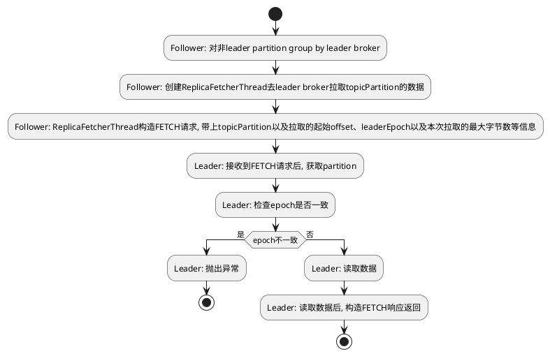

## KP-1 AbstractFetcherThread中的partitionStates是如何获取的
AbstractFetcherThread会通过partitionStates获取到对应broker的分区信息去leader的broker拉取数据，那partitionStates中的分区信息是哪里来的呢？

## KP-2 Follower拉取数据流程

## KP-3 Kafka如何发现follower中的脏数据
Leader Epoch 映射表

每个副本维护一个 LeaderEpochFile，记录 epoch → start_offset 的映射。例如：
```
epoch=5, start_offset=150
epoch=6, start_offset=201  # 新 Leader B 的第一个 offset
```
旧 Leader A 通过对比 B 的 LeaderEpochFile 发现本地 epoch=5 的 offset=201 无效。

Epoch 严格递增

新 Leader 的 epoch 必须大于旧 Leader 的 epoch，确保旧 Leader 的数据不会覆盖新数据。

幂等性同步

即使 A 多次重启，DivergingEpoch 机制会确保其最终与 B 一致。

### 什么是DivergingEpoch？
根据上述的Leader Epoch 映射表，如果发现本地的epoch与leader的epoch不一致，那么就会触发DivergingEpoch异常，从而对数据进行截断来保证主从同步
### high watermark的更新
Follower 的高水位（HW）更新遵循以下逻辑：

Leader 主导原则：Follower 的 HW 更新依赖于 Leader 在 FetchResponse 中返回的 当前 Leader 的 HW，而非 Follower 本地拉取的最后一条消息的 Offset。
Follower 会将自己的 HW 更新为 min(Leader 的 HW, Follower 的最后一条消息的 Offset)。
这是为了确保 HW 永远不大于 Leader 的 HW，避免数据不一致（脑裂风险）。

Leader会保存FETCH请求replica的fetchOffset作为follower的LEO,并从所有的Replica的LEO中取最小值作为HW
而在FETCH的响应中，Leader会返回HW给follower，follower会将HW更新为min(Leader的HW, Follower的LEO)

参考[例子](https://blog.csdn.net/HD243608836/article/details/126391609)

由于fetch的存在，当leader切换后，会检查epoch是否分叉，如果分叉则会截断数据，这样就保证了follower中的数据是幂等的，因此在写入数据的时候不必加锁，也不必担心leader切换epoch
变化时写入旧数据的问题

### Partition与Replica
Partition在ReplicaManager中代表一个分区， 而Replica则是分区的副本，Partition可能为leader或者follower