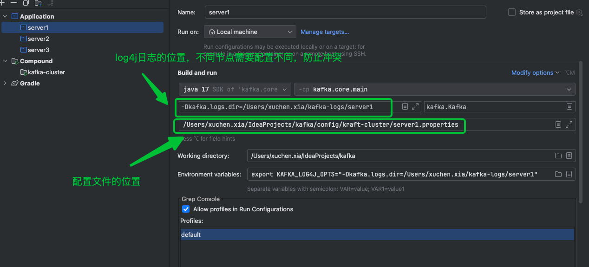
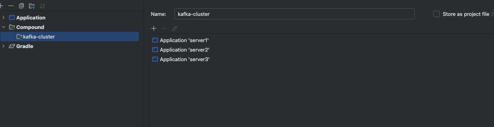

# 一、 初始化环境
## 前置条件
- JDK11+(我使用的是JDK17)
## 集群环境
| 主机名       | node id | 端口   | 角色         | 目录                     |
|-----------|---------|------|------------|------------------------|
| localhost | 1       | 9092 | broker     | data/kraft-log-server1 |
| localhost | 1       | 9093 | controller | ----                   |
| localhost | 2       | 9082 | broker     | data/kraft-log-server2 |
| localhost | 2       | 9083 | controller | ----                   |
| localhost | 3       | 9072 | broker     | data/kraft-log-server3 |
| localhost | 3       | 9073 | controller | ----                   |

使用Kraft模式, Kafka4.0
## 配置
### 配置文件
配置文件在[`config/kraft-cluster`](./config/kraft-cluster)文件夹下
### log4j依赖
直接启动时会有警告，且不打印日志。由于缺少日志的依赖依赖，需要添加依赖，参考[SLF4J: Failed to load class "org.slf4j.impl.StaticLoggerBinder"](https://stackoverflow.com/questions/46353762/slf4j-failed-to-load-class-org-slf4j-impl-staticloggerbinder-in-kafka-streams)

[build.gradle](./build.gradle)
```groovy
// 在:core模块下添加log4j2依赖
implementation libs.slf4jLog4j2
```
## 初始化集群
```shell
rm -rf data/kraft-log-server1
rm -rf data/kraft-log-server2
rm -rf data/kraft-log-server3

KAFKA_CLUSTER_ID="$(bin/kafka-storage.sh random-uuid)"
bin/kafka-storage.sh format -t $KAFKA_CLUSTER_ID -c config/kraft-cluster/server1.properties
bin/kafka-storage.sh format -t $KAFKA_CLUSTER_ID -c config/kraft-cluster/server2.properties
bin/kafka-storage.sh format -t $KAFKA_CLUSTER_ID -c config/kraft-cluster/server3.properties
```
参考：[KRaft Quickstart](https://kafka.apache.org/quickstart)
这里需要注意的是，我们的集群是三节点，而官网的例子是单节点standalone模式，`bin/kafka-storage.sh format`命令不能添加`--standalone`参数，否则多个节点无法组成一个集群(**笔者深受其害T—T**)
## IDEA配置
### 节点配置

### Idea Compound配置
由于我们的集群有多个节点，每次一个一个启动太麻烦，我们可以使用Idea的Compound配置来一键启动所有节点

## kafka-console-ui使用
由于kafka本身没有提供web ui，为了方便操作，可以使用[kafka-console-ui](https://github.com/xxd763795151/kafka-console-ui)(仅用于测试学习，生产可以使用[KnowStreaming](https://github.com/didi/KnowStreaming))

具体使用方法请参考官方文档
